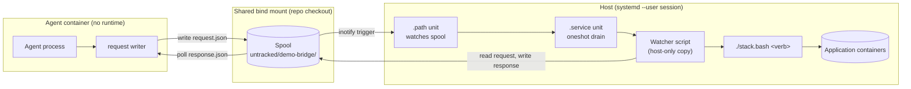
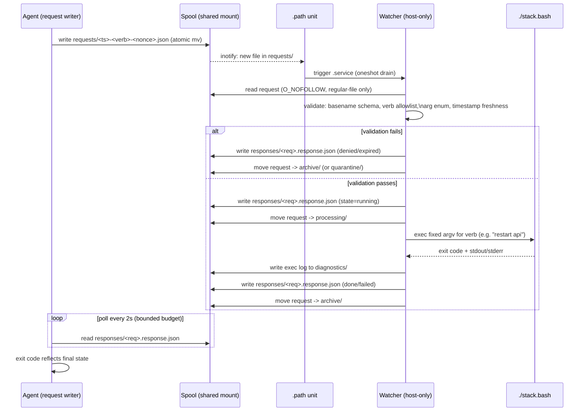
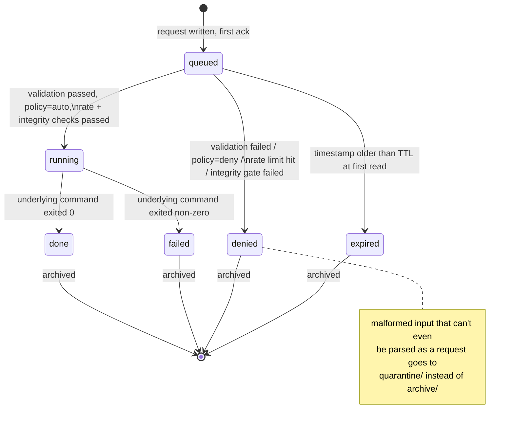

# Architecture

This describes the mechanism precisely enough to reimplement it. All names
below are sanitised placeholders — see `snippets.md` for the illustrative
code and the plan's hygiene checklist for the naming convention.

## The situation

An agentic coding session runs inside a disposable, permission-relaxed
container (`ccy` / claude-yolo). Deliberately, that container ships with
**no container runtime** — no `podman`, `docker`, or `podman-compose`
binary, and no socket. That is the security boundary: if the agent (or
something it's tricked into running) is compromised, it cannot reach the
host's container engine, cannot see other containers, cannot touch the
host filesystem outside the one bind-mounted repo.

The problem this creates: real work on a multi-container application
(a web tier, an API tier, a database, background workers) means the agent
legitimately needs to start the stack, restart one service after a config
change, rebuild an image after a dependency bump, or just check whether
everything is up. Every one of those is normally a shell command against
the container engine — exactly what the sandbox forbids.

The bridge is the answer: a narrow, asynchronous, file-based channel that
lets the agent *request* one of a fixed set of orchestration actions
without ever gaining the ability to run arbitrary commands.

## Components

- **Request writer** (in the agent container). A small script that builds
  a JSON request object, writes it atomically into the spool's
  `requests/` directory, then polls for a response file. It never runs
  the container engine itself — writing a file is all it does.
- **Spool** (`untracked/demo-bridge/` inside the repo checkout, therefore
  on the shared bind mount both sides can see). Subdirectories: `tmp/`
  (staging for atomic writes), `requests/` (incoming), `processing/`
  (claimed by the watcher mid-run), `responses/` (outcome the agent
  polls), `archive/` (completed requests + their exec logs), `quarantine/`
  (malformed/hostile input that could not even be classified),
  `diagnostics/` (mirrored logs for the agent to read directly, since the
  real logs live off-mount).
- **`.path` systemd user unit** on the host. Watches `requests/` for new
  files (`PathModified` + `PathExistsGlob`, so a request queued while the
  watcher was down is still picked up on next start) and triggers the
  paired `.service` unit.
- **`.service` systemd user unit** — `Type=oneshot`. Runs the watcher
  script's `drain` subcommand once per trigger, then exits. Because it's
  a oneshot rather than a long-running daemon, there's no persistent
  process to keep patched or to leak state between runs.
- **Watcher script** — the trusted computing base. Installed to a
  host-only path the agent container cannot write to (outside the bind
  mount). Validates each request against a closed verb allowlist, maps
  the verb to a fixed argv, executes it, writes a response. See
  `security-model.md` for the validation pipeline in full.
- **Response files** — one per request, in `responses/`. The agent polls
  for a terminal state (`done` / `failed` / `denied` / `expired`).
- **Exec logs** — per-request stdout/stderr capture in `diagnostics/`, so
  the agent can see exactly what the underlying orchestration command
  printed, without ever running it directly.

## Request lifecycle

Every request leaves `requests/` on every code path — accepted, denied,
expired, or unreadable. That single invariant ("a request always leaves
the inbox") is what stops a malformed file from wedging the pipeline: the
`.path` unit keeps re-triggering on anything still sitting in
`requests/`, so if the watcher ever left a bad file in place it would
crash-loop the service. Quarantining unprocessable input, rather than
leaving it or deleting it silently, keeps the audit trail intact while
guaranteeing forward progress.

## State machine

The `queued` state exists for a subtle reason: the watcher acknowledges
*every* pending request the instant it starts draining — before doing any
real validation — specifically so a concurrent watcher invocation that
lost the single-flight lock still writes an ack. Without that, a losing
invocation could leave a request un-acknowledged, and the agent's poll
loop would time out waiting for a first ack even though a winning
invocation was about to process it moments later.

## Why file-based, not a socket or HTTP listener

The spool lives inside the repo's bind mount, which both the agent
container and the host can already see without any extra plumbing — no
new listening port, no new inter-container network path, nothing to
firewall. It also means the bridge still works when the whole stack is
completely down: there's no service to be "up" for the request/response
mechanism itself, only the systemd user session on the host, which is
running by definition once the human is logged in.

The trade-off is latency: this is a polling design with a multi-second
turnaround, not a low-latency RPC. That's a deliberate and acceptable
trade — the verbs being bridged are things like "rebuild an image" or
"restart a service", not high-frequency calls.
